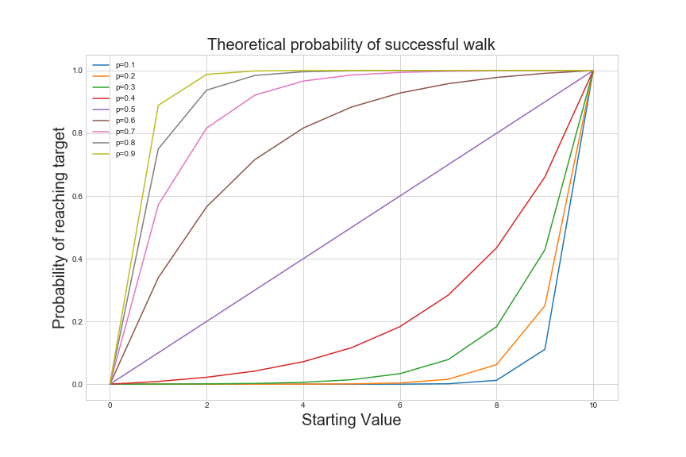

# Gambler's Ruin and the Random Walk



This is for a [blog post](https://akhiljalan.github.io/2018-01-29-random-walks/) about winning a version of **gambler's ruin**, a gambling game built on a random walk on the integers. 

All code and the finalized writing is on the blog post itself. I wrote a draft version of the post and ran code in ```simple_symmetric_random_walk.ipynb```. 
